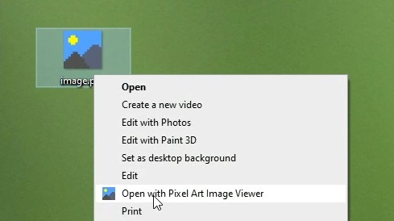

# Pixel Art Image Viewer
Pixel Art Image Viewer is a dedicated tool for viewing pixel art images without distortion, blur, or zoom limitations.

Many standard image viewing programs apply a blur filter to images, which is ideal for high-resolution photos but results in poor display quality for low-resolution pixel art. Additionally, most programs have limited or ineffective zoom functionality for pixel art images. Pixel Art Image Viewer addresses these issues, providing a more accurate and optimized experience for viewing pixel art.

## Usage
Using Pixel Art Image Viewer is easy.
Just right-click on an image and press `Open with Pixel Art Image Viewer` in the context menu.

## Requirements
The software requires JRE 1.8 and is only tested on Windows.

## Known Issues
- When resizing the window, the image doesn't scale

## Contribute
Contributions are always welcome!

Recommended IDE setup:
- IntelliJ IDEA Community Edition 
- JDK 1.8 (liberica-full-1.8 + SDK Level 8). Newer versions don't work. (javafx.scene.image.ImageView.impl_createPeer removed in later versions)

Creating Setup.exe:
- Build project to .jar file and move it this location `PixelArtImageViewer Compile/Pixel Art Image Viewer.jar`.
- Use Launch4j to convert .jar file to a .exe. (Config file: `PixelArtImageViewer Compile/PixelArtImageViewer.xml`)
- For the creation of the setup.exe and the registry entries Inno Setup is used. (Config file: `PixelArtImageViewer Compile/PixelArtImageViewer.iss`)

## License
Pixel Art Image Viewer is licensed under [GNU GENERAL PUBLIC LICENSE](https://www.gnu.org/licenses/gpl-3.0.en.html).

## Credits
Thanks to:
- james-d
- clarkbean710
- ajeje93
- Martin Sojka
